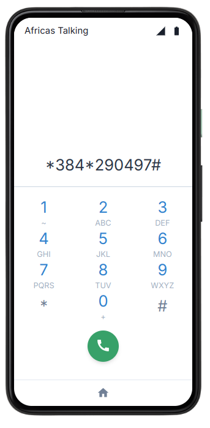

# 📦 USSD Price Tracker

A USSD-based price comparison and mobile payment platform designed for offline users in Kenya.
see the [pitch Deck](./pitch-deck.md)

---

## 🚀 Built With

* 
*  
*  
*  
*  
*  
*  

---

## 🖼️ Sample Image


---

## 📖 About The Project

This project is a USSD application that allows users without internet access to:

* Check and compare product prices in real-time
* Purchase products via M-PESA STK Push
* Receive SMS alerts for product updates
* Earn tokens for each purchase to receive more SMS notifications

It leverages Flask for the backend, Express for M-PESA logic, and MongoDB for data storage. The USSD menu and SMS services are powered by Africa's Talking APIs.

---

## 🛠 Getting Started

### 🔐 Prerequisites

* Python 3.8+
* Node.js 14+
* Ngrok account (for tunneling localhost)
* Africa's Talking & KCB BUNI credentials

### 🧰 Installation

```bash
# Clone the repo
$ git clone https://github.com/manassehgitau/price-tracker-scraper.git
$ cd price-tracker-scraper

# install a virtual environment and activate it
$ python3 -m venv .venv
$ source .venv/bin/activate # for MacOS and Linux based systems 
$ source .venv/Scripts/activate # for windows

# Install Python dependencies
$ pip install -r requirements.txt

# Install Node dependencies (for M-PESA API)
$ cd mpesa-server
$ npm install
```

### ▶️ Usage

```bash
# Start Flask server (USSD + SMS)
$ flask run

# Start Express server (M-PESA logic)
$ node index.js

# Start Ngrok to tunnel USSD requests
$ ngrok http 5000
```

Ensure callback URLs are set correctly in your Africa's Talking and M-PESA dashboards using the ngrok link.

---

## 🛣️ Roadmap

* [x] USSD product listing & navigation
* [x] M-PESA STK Push integration
* [x] Token system based on purchase amount
* [ ] Admin dashboard for vendors
* [ ] Voice-based USSD flow
* [ ] Add multi-language support

---

## 🤝 Contributing

Contributions are welcome! Please fork the repo and submit a pull request.

1. Fork the project
2. Create your feature branch (`git checkout -b feature/new-feature`)
3. Commit your changes (`git commit -m 'Add new feature'`)
4. Push to the branch (`git push origin feature/new-feature`)
5. Open a Pull Request

---

## 📄 License

Distributed under the MIT License. See `LICENSE` for more information.

---

## 📬 Contact

**Manasseh Gitau**
[GitHub](https://github.com/manassehgitau)
Email: [gitaumanasseh1@gmail.com](mailto:gitaumanasseh1@gmail.com) 

---
